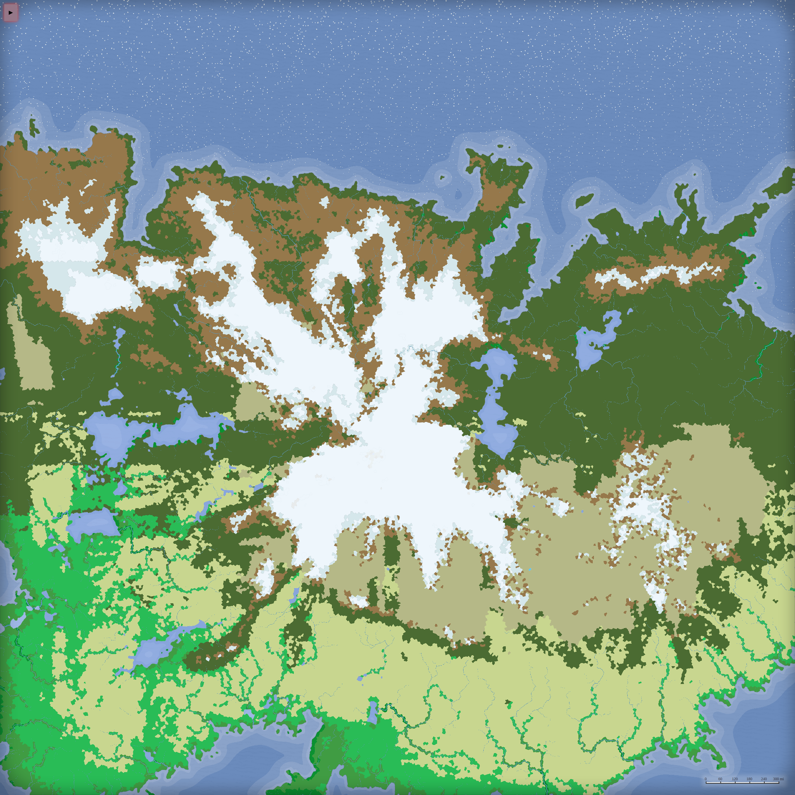
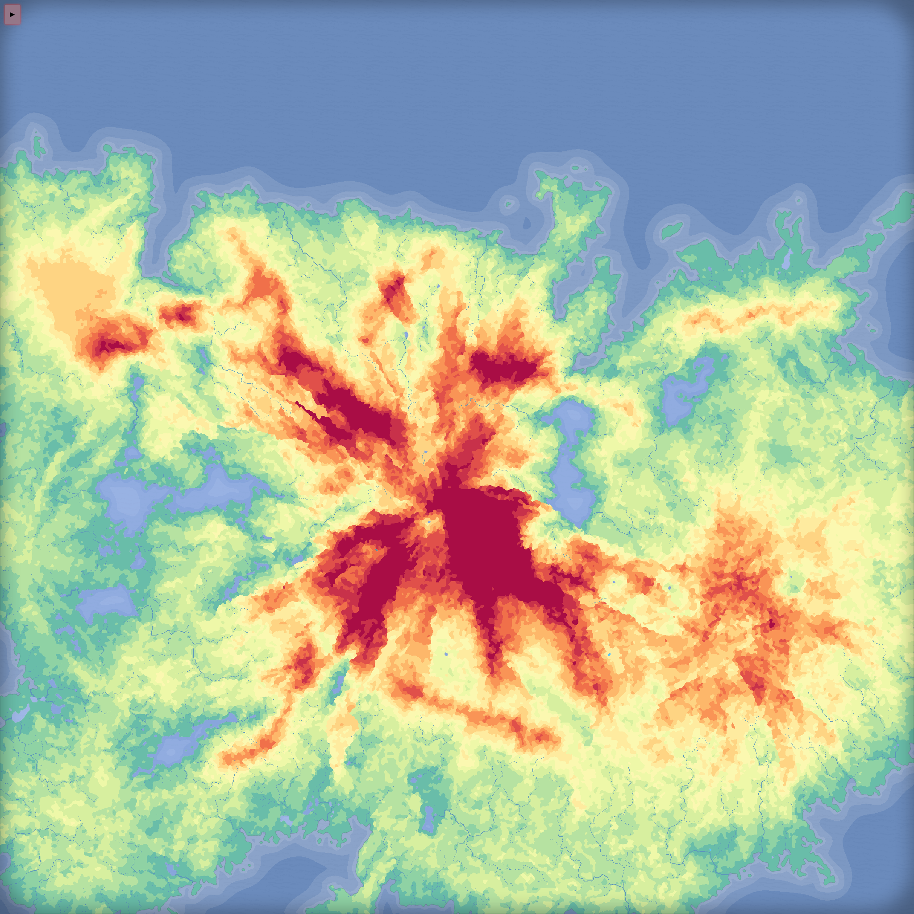
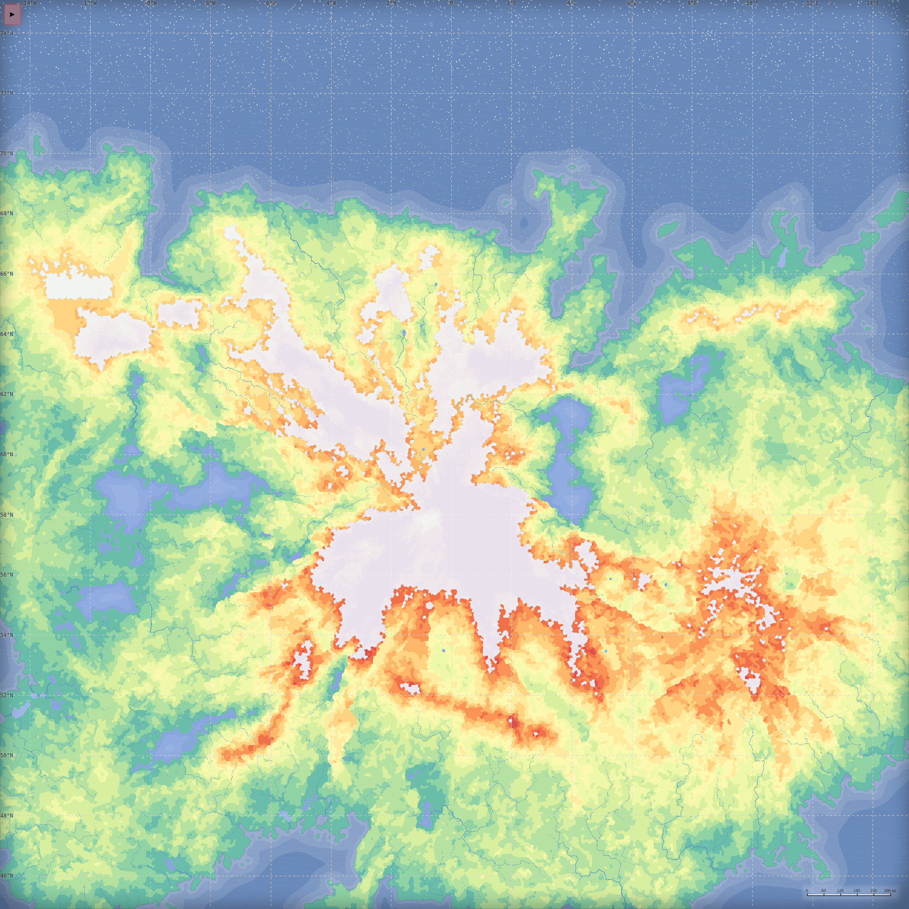

# Northreach — Northern Wilderness Terrain

A vast, glaciated northern super-region generated with
[Azgaar's Fantasy Map Generator](https://github.com/Azgaar/Fantasy-Map-Generator)
(FMG) as the macro-scale foundation for an RPG game terrain. The map realises
the vision in `docs/terrain-description.txt` (hostile glaciated coastline, walls of
mountains around a colossal central peak, taiga wilderness, open southern
plains, fractured volcanic uplands, river-carved everything).

## The deliverable

**`map/Northreach.map`** — load it at
[azgaar.github.io/Fantasy-Map-Generator](https://azgaar.github.io/Fantasy-Map-Generator)
via *Menu → Load → from machine*. Saved by FMG v1.109; current FMG versions
auto-upgrade older `.map` files on load. From there you can retouch biomes,
then export the heightmap and per-biome monochrome masks for the splatmap
(*Menu → Export*), and take those into Gaea 2.

Note: the map was built from a custom heightmap template injected at generation
time ("northreach"), so the *Template* field in a fresh FMG session shows a
fallback name — cosmetic only, all terrain data is baked into the file.

## What's in the map

| Vision element | Where it landed |
|---|---|
| Cold hostile sea, one edge | Entire northern edge; ice-flecked water, sea ice at high latitudes |
| Fjords, headlands, fractured coast | Northern coastline, deep inlets NE and N-center |
| Central colossal peak | Glaciated supermassif at map center (height 100), ranges radiating N/NE/SW/SE |
| Mountain walls / rare passes | NW range chain, eastern highland massif, southern arc ranges |
| Extensive evergreen forest | Taiga belt (~27% of cells) ringing the mountain core |
| Open plains & grasslands | South and southwest (grassland ~18%, temperate forest further south) |
| Volcanic / barren uplands | Eastern cold-desert plateau with scattered ice patches (~10%) |
| Tundra & glacial reaches | Tundra coast belt (~10%), glacier (~14%) on the massif and far north |
| Rivers from glaciers to sea | 839 rivers with full watershed logic, big glacial-lake basins W and NE |

World-scale settings: 2048×2048 px canvas, ~100k cells (77,338 packed),
latitude span 45–75°N, scale 1.6 km/px ≈ **3,300 × 3,300 km** region.

## Previews

| Biomes | Heightmap | Physical |
|---|---|---|
|  |  |  |

## Gaea-ready exports (`export/`)

Pre-extracted 4096×4096 PNGs, rendered headlessly from `map/Northreach.map`
with `tools/extract.js` (no browser viewport involved):

- `biome_NN_<name>.png` — one monochrome mask per biome (white = biome,
  black = everything else), same polygon-fill approach as the in-browser
  console script, at 2× map resolution.
- `heightmap.png` — grayscale, FMG height 0–100 mapped linearly to 0–255,
  so **sea level = gray 51**. Ocean floor rendered from the uniform grid
  (smooth), land from packed cells (refined coastlines).
- `mask_water.png` — white = ocean + lakes (cells below sea level).
- `mask_rivers.png` — the full 839-river network rasterized white-on-black.
- `biomes.json` — biome ids, names and cell counts present on the map.

Regenerate with:
`node tools/extract.js map/Northreach.map 2` (last arg = scale factor;
requires the local FMG mirror serving on :8099, see below).

### Viewing the map on the FMG website

The map canvas is 2048×2048. FMG's zoom floor is 100 %
(`zoom.scaleExtent([1, 20])`), so on a smaller browser window you can only
ever see a window-sized portion — the map is fine, the viewport is clipped.
To see all of it, run this once in the browser console after loading:

```js
zoom.scaleExtent([0.2, 20]);
```

then zoom out with the mouse wheel. (Alternatively use Tools → Transform to
resample the map down to your screen size, but that permanently reduces
detail — not recommended before exporting.)

## Reproducing / regenerating

Everything is scripted and deterministic (seed `20260701`):

1. `tools/fetch-fmg.sh fmg/` — mirrors FMG v1.109 (static build) from
   raw.githubusercontent.com.
2. `cd fmg && python3 -m http.server 8099 --bind 127.0.0.1`
3. `npm install playwright-core` (a Chromium binary is required; the script
   uses `/opt/pw-browsers/chromium` — adjust `executablePath` in
   `tools/driver.js` for your machine).
4. Put `map/generation-config.json` next to `driver.js` as `config.json`, then
   `node tools/driver.js --save` — generates the map headlessly, writes
   diagnostic screenshots + biome stats to `out/`, and saves the `.map`.
5. `node tools/verify-load.js <file.map>` — round-trip load check.

`map/generation-config.json` holds the whole recipe: the custom FMG heightmap
template (step list), climate (temperature equator/pole, precipitation,
height exponent 1.8), latitude window, and cell density. Tweak numbers there
and re-run; edits that keep the step count identical preserve the layout
because the template RNG stream stays aligned.

## Pipeline (next stages)

1. **You are here** — FMG macro map: continent shape, mountain systems,
   watershed-correct rivers, climate-driven biomes.
2. **FMG manual pass** — tidy biome edges, then export: heightmap PNG,
   one monochrome mask per biome (splatmap channels), rivers overlay.
3. **Gaea 2** — erosion, glacial carving, talus/scree, fjord detail from the
   heightmap + biome masks.
4. **Blender** — final assembly (displacement, scatter forests, materials,
   atmosphere) per the terrain-design brief. The full Blender stage needs a
   live Blender instance with an MCP bridge (e.g. blender-mcp addon) plus
   scatter/vegetation addons — not available in this remote session, so the
   Blender work is intentionally deferred.
